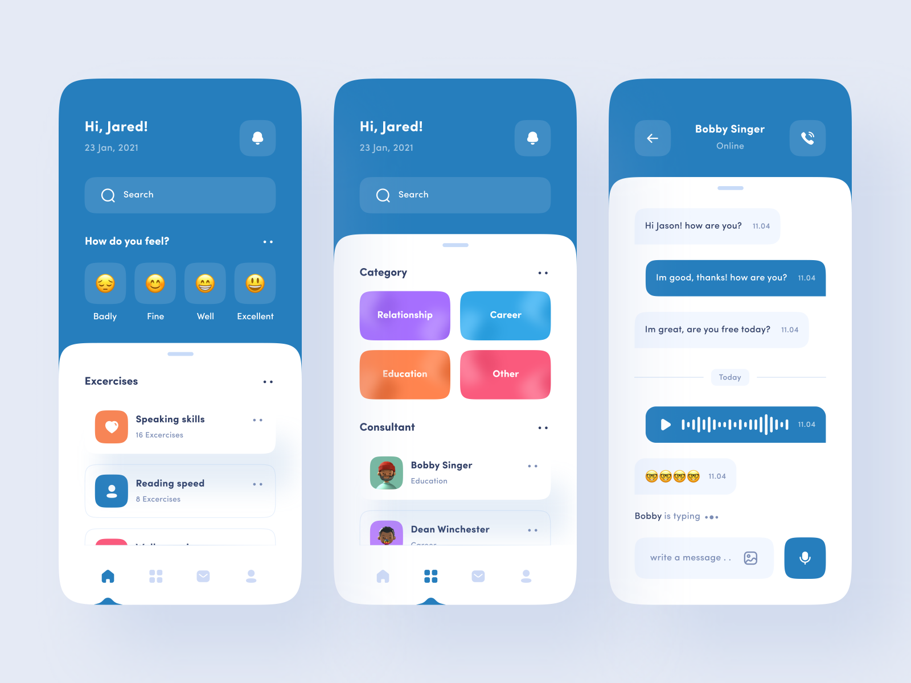

# Mental Health App

## Description

The Mental Health App is designed to support users in managing their emotional well-being. It provides a platform for tracking daily emotions, personalized activity recommendations, and progress monitoring.

## Table of Contents

- [Requisites](#requisites)
- [Installation](#installation)
- [Features](#features)

## Requisites

Before installing the Mental Health App, ensure that you have the following prerequisites:

- [Flutter](https://flutter.dev/): Flutter is the framework used to build the app. Make sure you have Flutter installed on your system. You can follow the installation guide [here](https://flutter.dev/docs/get-started/install).

## Installation

To install the Mental Health App, follow these steps:

1. Clone the repository: `git clone https://github.com/kauanhindlmayer/mental-health-app.git`
2. Navigate to the project directory: `cd mental-health-app`
3. Install dependencies: `flutter pub get`
4. Connect your mobile device or start an emulator.
5. Run the app on your device: `flutter run`

Now, the Mental Health App should be up and running on your Flutter environment.

## Features

- Emotion tracking with categorization (e.g., `poor`, `good`, `very good`, `excellent`).
- Personalized mental health activity recommendations (e.g., meditation, physical exercises).
- Educational resources on mental health.
- Progress tracking over time.
- Manage personal activities.
